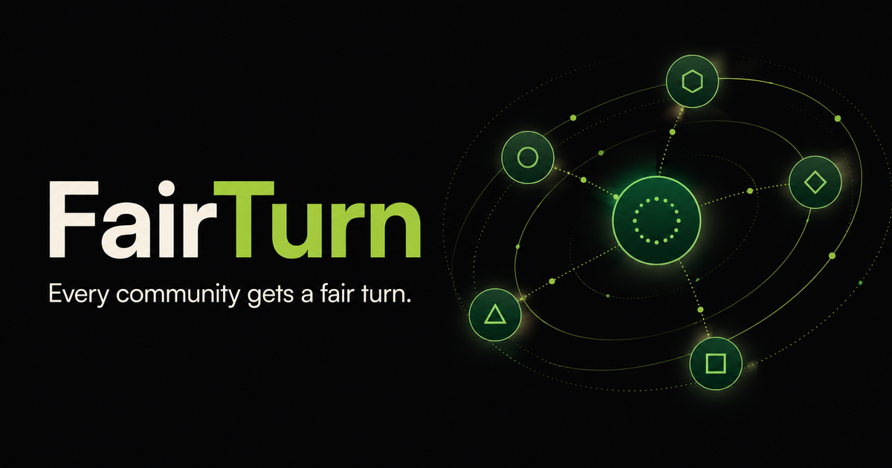
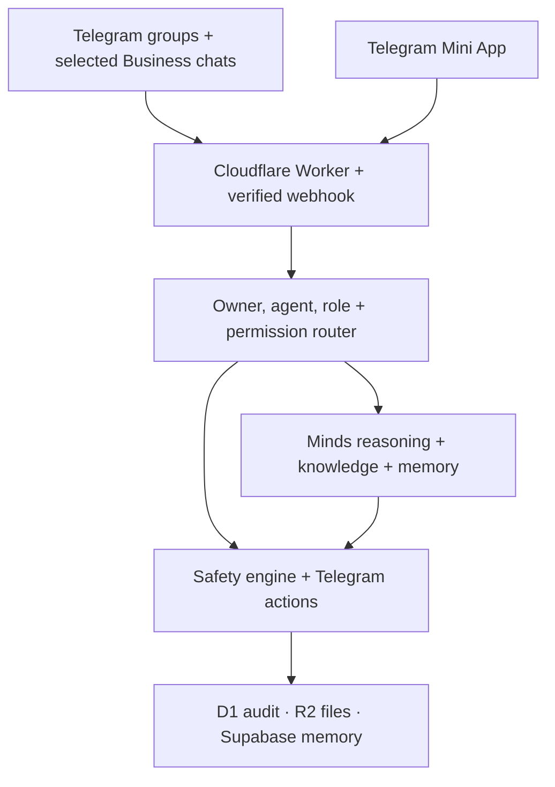

<p align="center">
  
</p>

<h1 align="center">FairTurn</h1>

<p align="center">
  <strong>An AI community manager that protects Telegram communities, helps members, and gives every moderator a fair turn.</strong>
</p>

<p align="center">
  Built for the <strong>Creative Minds Hackathon — Track 3: Moderation &amp; Community Assistance</strong>
</p>

<p align="center">
  <a href="https://fairturn.ahmardchain.chatgpt.site"><strong>Live Mini App</strong></a>
  ·
  <a href="https://github.com/ahmardchain/fairturn"><strong>Source Code</strong></a>
  ·
  <a href="#deploy-to-cloudflare"><strong>Deploy</strong></a>
</p>

<p align="center">
  <a href="https://deploy.workers.cloudflare.com/?url=https://github.com/ahmardchain/fairturn">
    
  </a>
</p>

## The problem

Creator communities grow faster than their teams can manage them. Scams,
admin impersonation, harassment, raids, unanswered questions, missed
opportunities, and moderator burnout all arrive in the same noisy chat.
Traditional moderation bots mostly match keywords and delete messages. They do
not understand intent, remember community decisions, or help with the work that
keeps a community healthy.

## The solution

**FairTurn is a persistent, Telegram-first AI teammate.** It combines
context-aware moderation, community assistance, engagement automation, and
creator-controlled subagents in one Mini App.

FairTurn understands normal language—there is no command menu to memorize. A
member can ask, “What are the giveaway rules?” An admin can reply to a message
with, “FairTurn, mute this user for one hour.” A creator can say, “Create an AMA
poll for Friday and close it in two hours.”

## Manager and subagent model

FairTurn is the main manager. A creator may also create one separate Telegram
subagent in the MVP. Both agents use the same moderation and assistant engine;
the differences are management authority, identity isolation, and inbox access.

| Capability | FairTurn manager | Creator subagent |
|---|:---:|:---:|
| Full community moderation | ✅ | ✅ |
| Community Q&amp;A and assistance | ✅ | ✅ |
| Polls, quizzes, events, giveaways, posts, and tasks | ✅ | ✅ |
| Own persona, rules, welcome message, memory, and knowledge | ✅ | ✅ |
| Own connected groups, access settings, tasks, and audit history | ✅ | ✅ |
| Create, configure, monitor, and remove subagents from FairTurn | ✅ | — |
| Automate owner-selected Telegram Business inbox chats | — | ✅ |

Subagent data is isolated by owner and agent ID. Bot tokens are encrypted on the
server and never returned to the Mini App. Removing a subagent from FairTurn is
supported, while deleting the underlying Telegram bot still requires the
owner’s confirmation in `@BotFather`.

## Core capabilities

### 🛡️ Intent-aware moderation

- Detects spam, repeated links, referral abuse, scams, harassment, bullying,
  hate speech, threats, doxxing, NSFW text, and suspicious coordinated activity.
- Uses Minds to understand message intent and community context instead of
  relying only on keyword lists.
- Applies a progressive offense flow: warn, one-hour mute, then a ban proposal
  unless the creator explicitly enables confirmed automatic bans.
- Records the reason, rule, action, timestamp, user, agent, and execution result
  in an auditable moderation trail.
- Keeps deterministic safety rules available when Minds is temporarily
  unavailable and labels that fallback honestly.

### 🥸 Anti-Impersonation Shield

FairTurn compares a non-admin sender with Telegram’s verified administrator
list using display-name similarity, Unicode-confusable usernames, and exact
Telegram profile-photo file identity. Minds then evaluates the complete message
for scam or social-engineering intent.

For automatic enforcement, FairTurn requires both strong identity resemblance
and at least **92% scam-intent confidence**. It can then:

1. Delete the scam message.
2. Restrict the impersonator indefinitely.
3. Record the evidence and Telegram action results.
4. DM the creator a safe evidence summary without repeating the dangerous link.

Verified administrators, benign lookalikes, and incomplete identity checks do
not enter this automatic path. The photo signal is exact Telegram file identity,
not biometric face recognition.

### 🗣️ Conflict intervention

FairTurn separates ordinary disagreement from continued hostility. The first
contextual detection produces a calm warning. A one-hour mute requires a later
Minds classification showing that the hostility continued after the warning.
Criticism, quotations, jokes, and reconciliation are not enough by themselves.

### 🚨 Anti-raid protection

Five joins within sixty seconds activate the raid gate. Pending join requests
remain queued, and newly arrived members receive a temporary posting
restriction. Telegram’s Bot API cannot change a group’s native slow-mode delay
or reveal a reliable account-creation date, so FairTurn uses supported controls
and reports unavailable signals instead of guessing.

### ✨ Community assistant

- Welcomes new members and answers questions from rules, FAQs, websites,
  whitepapers, documents, creator instructions, and persistent memory.
- Summarizes important discussions, decisions, unresolved questions, and
  creator opportunities after time away.
- Surfaces partnerships, sponsorships, collaborations, and important requests
  that might otherwise disappear in chat noise.
- Sends and refreshes Telegram’s typing indicator while it is reasoning.
- Responds in the member’s language when the available knowledge supports it.

### 📅 Engagement and automation

- Scheduled and recurring posts, reminders, summaries, events, quizzes,
  giveaways, and polls in the creator’s local timezone.
- Native Telegram polls with open/close time, poll ID, message ID, option totals,
  and conversational follow-up questions.
- Voter names and choices are available only for non-anonymous polls created by
  the bot; anonymous polls remain aggregate-only.
- Secure giveaway entry and creator-approved winner selection; prize release is
  never automatic.
- Natural task instructions—the creator describes the outcome and FairTurn
  infers the correct community action.

### 📥 Subagent-only inbox automation

Only a creator-owned subagent can connect to Telegram Business, and only for the
private chats selected by its verified owner. It can summarize unread DMs,
prioritize requests, detect opportunities, answer approved common questions,
draft personalized replies, and escalate sensitive conversations.

The main FairTurn manager rejects Business inbox updates at the backend, even
if someone manipulates the frontend. Sensitive replies require creator approval
unless the creator explicitly enables a permitted automation.

## Minds: the intelligence layer

Minds is an integral runtime dependency, not a badge or optional marketing
integration. FairTurn uses the official `@animocabrands/minds-client-lib` to:

- verify the configured Mind UUID, enabled state, shareable identity, and
  cognition balance before reporting it as connected;
- maintain a stable, privacy-safe conversation per owner, agent, and chat;
- combine persona, rules, community knowledge, relevant memory, and current
  context for each decision;
- validate a strict structured moderation/assistant response contract;
- store a Mind reply fingerprint and referenced memory IDs as judgeable
  evidence of memory → reasoning → action;
- fall back to deterministic safety rules during an outage without pretending
  that contextual Minds reasoning ran.

The public `GET /api/minds/status` endpoint exposes secret-free integration
proof. The app reports `connected` only after live verification succeeds.

## Architecture



| Layer | Technology | Responsibility |
|---|---|---|
| Product surface | Telegram Mini App, Next.js 16, React 19 | Agent settings, memory, knowledge, tasks, inbox setup, and status |
| Edge runtime | Cloudflare Workers + Vinext | Webhooks, APIs, reasoning orchestration, scheduler, and secure actions |
| Operational data | Cloudflare D1 | Agent state, groups, polls, automations, offenses, approvals, and audit records |
| Private files | Cloudflare R2 | Creator-uploaded PDF, DOCX, text, and knowledge sources |
| Long-term memory | Supabase | Redacted preferences, decisions, corrections, and reusable precedents |
| Intelligence | Minds Builder API | Contextual moderation, assistance, persistent conversations, and memory-aware reasoning |
| Messaging | Telegram Bot API + Business Bots | Groups, native polls, moderation actions, managed bots, and selected inbox chats |

## Privacy and responsible AI

- FairTurn stores normalized summaries, fingerprints, classifications,
  aggregate results, explicit non-anonymous poll choices, and audit metadata—not
  a raw-message archive.
- Uploaded knowledge files are an intentional exception: they are private,
  owner-scoped, removable sources stored in R2.
- Permanent automatic bans require an explicit second confirmation in the
  community policy, except the narrow high-confidence impersonation-scam path.
- Ambiguous policy decisions escalate instead of inventing a rule.
- Business inbox access is opt-in, selected-chat only, owner-verified, and
  restricted to subagents.
- Adding a bot does **not** make Telegram messages end-to-end encrypted. Telegram
  transport and platform rules still apply.
- Automatic learning follows authoritative admin signals; ordinary members and
  instructions hidden inside uploaded documents cannot silently rewrite policy.

## Judgeable live proof

| Endpoint | Evidence |
|---|---|
| `GET /api/health` | Honest Telegram, Minds, storage, and safety status |
| `GET /api/minds/status` | Verified Mind identity, enabled state, and cognition without exposing the API key |
| `GET /api/hackathon/readiness` | Implemented capabilities separated from credentials and observed live proof |
| `POST /api/moderation/check` | Protected dry-run of the deterministic moderation policy; no external action |

The [live Mini App](https://fairturn.ahmardchain.chatgpt.site) can be explored in
safe demo mode. Real Telegram actions and Minds reasoning activate only after
valid production credentials pass FairTurn’s runtime checks.

## Deploy to Cloudflare

[](https://deploy.workers.cloudflare.com/?url=https://github.com/ahmardchain/fairturn)

Cloudflare reads `wrangler.jsonc` and automatically provisions the D1 database
and R2 bucket declared without account-specific IDs. The guided deployment also
reads `.env.example` and asks for the integration values. Never commit real
tokens or keys.

### Runtime values

| Variable | Purpose |
|---|---|
| `TELEGRAM_BOT_TOKEN` | Main FairTurn manager token from `@BotFather` |
| `TELEGRAM_WEBHOOK_SECRET` | Authenticates Telegram webhook deliveries |
| `MANAGED_BOT_ENCRYPTION_KEY` | Random 32+ character key for encrypting subagent bot tokens |
| `MINDS_BUILDER_API_KEY` | Private Minds Builder API key |
| `MINDS_MIND_ID` | UUID of the enabled FairTurn Mind |
| `SUPABASE_URL` | Optional longitudinal-memory project URL |
| `SUPABASE_SECRET_KEY` | Optional server-only Supabase secret key |
| `ADMIN_ACTION_SECRET` | Protects operator-only moderation and Minds routes |
| `CRON_SECRET` | Protects scheduled automation execution |

The `postdeploy` hook automatically applies the committed D1 migrations after
Cloudflare provisions `fairturn-db`, including deployments started from the
button above.

For manual deployment:

```bash
npm ci
npm run build
npm run deploy
```

Cloudflare’s deploy button provisions and binds resources automatically, and the
post-deploy migration script discovers the provisioned D1 database before
applying the schema. This keeps the repository free of another account’s
database ID.

## Telegram setup

1. Create the main FairTurn bot in `@BotFather` and enable **Bot Management
   Mode**.
2. Set the deployment URL as the bot’s Main Mini App.
3. Point the webhook to `https://<your-domain>/api/telegram/webhook` and use the
   same strong secret stored as `TELEGRAM_WEBHOOK_SECRET`.
4. Include `managed_bot`, `message`, `business_connection`, `business_message`,
   `callback_query`, `chat_join_request`, `my_chat_member`, `poll`, and
   `poll_answer` update types.
5. Grant only the group permissions the community enables: delete messages,
   restrict members, or ban members.
6. For inbox assistance, enable Telegram Business/Secretary Mode on the
   creator-owned subagent and select the private chats it may access. The main
   manager cannot use this capability.

## Local development

Requirements: Node.js `>=22.13.0`.

```bash
npm ci
cp .env.example .env.local
npm run db:generate
npm run dev
```

Verification:

```bash
npm run lint
npm test
```

The automated contract suite covers the rendered Mini App, agent-role isolation,
Telegram webhook behavior, moderation safeguards, Minds status, D1 migration,
Supabase memory security, tasks, polls, knowledge, and typing keep-alive.

To produce a secret-free cross-session Minds persistence artifact after adding
valid credentials:

```bash
npm run proof:minds
```

## Why FairTurn fits Track 3

| Judging lens | FairTurn evidence |
|---|---|
| Minds integration depth | Official client, live identity/cognition verification, stable conversations, memory references, and decision fingerprints |
| Creator-economy problem fit | Protects communities while rescuing opportunities and reducing creator/moderator workload |
| Innovation | Intent-aware impersonation defense, manager/subagent architecture, decision memory, and natural-language community operations |
| Execution | Telegram-native actions, Mini App, managed bots, D1/R2/Supabase persistence, scheduling, polls, and audit trails |
| Responsible AI | Confidence gates, progressive enforcement, human approval boundaries, minimal retention, and honest fallback status |
| Scalability | Edge runtime, owner/agent/chat isolation, encrypted bot tokens, idempotent webhooks, and timezone-aware automation |

## Current status

- Mini App, backend routes, moderation engine, agent isolation, tasks, polls,
  knowledge, and safe demo flows are implemented.
- Cloudflare Worker, D1, and R2 deployment configuration is included.
- Minds and Telegram integrations are code-complete but become live only after
  legitimate credentials and platform configuration are supplied.
- `/api/hackathon/readiness` remains the source of truth for the difference
  between implemented capability and observed live proof.

---

Built by [Ahmard](https://github.com/ahmardchain), a solo software engineer and
student, for safer and healthier creator communities.
