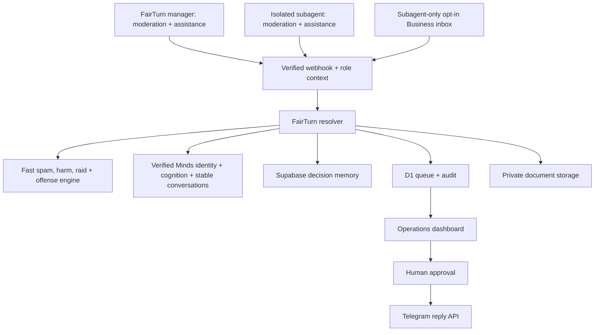

# FairTurn

[](https://deploy.workers.cloudflare.com/?url=https://github.com/ahmardchain/fairturn)

What is FairTurn?
FairTurn is a persistent AI teammate for creator communities that doesn't just moderate messages — it helps run the human system behind the community.
Creator communities grow fast. But as engagement increases, so do scams, harassment, moderator burnout, missed opportunities, inconsistent decisions, unanswered questions, and overwhelming conversations.

The main **FairTurn agent** and its creator-owned **subagent** both provide the
complete moderation and community-assistant feature set. FairTurn additionally
manages the subagent lifecycle. The subagent has isolated identity, settings,
memory, groups, knowledge, tasks, and audit history—and it alone may connect to
Telegram Business for only the private chats its verified owner selects.


# 🛡️ FairTurn Moderation

Protects the community and helps moderators manage it fairly.

🧠 Context-Aware Moderation

Understands the intent and context of messages instead of relying only on keyword lists.

Detects:

- Spam and repeated messages
- Scam links and social engineering
- Harassment and bullying
- Hate speech and threats
- Doxxing
- NSFW content
- Suspicious behavior

🥸 Anti-Impersonation Shield

Detects users pretending to be creators, admins, or moderators.

FairTurn can combine identity similarities with conversation intent to recognize attacks such as:

Fake Admin → “DM me to verify your wallet” → scam intent detected

It can remove the message, restrict the impersonator, and report evidence to administrators.

🗣️ Argument Intervention

FairTurn recognizes when normal disagreement is turning into a hostile argument.

It can step into the conversation, ask participants to stop, and escalate moderation when they continue.

🚨 Anti-Raid Protection

Detects unusual waves of suspicious joins or coordinated activity and can activate protective measures.

🤝 Moderator Pact

Moderators define their:

- Availability
- Capacity
- Expertise
- Content boundaries
- Cases they don't want to review

FairTurn respects those boundaries when distributing moderation work.

⚖️ Fair Workload

FairTurn prevents the same moderators from constantly carrying the community.

It distributes work based on availability, capacity, previous workload, and moderator boundaries.

Everyone gets a FairTurn.

🗣️ Decision Huddles

When community rules are ambiguous, FairTurn can escalate the case instead of making up an answer.

Moderators discuss it, reach a decision, and that clarification can become persistent knowledge for similar future situations.

📜 Moderation Audit Trail

Important moderation actions can record:

- What happened
- Why FairTurn flagged it
- Which policy was involved
- What action was taken
- Whether a human intervened

---

# FairTurn Assistant

Helps creators run, understand, and engage their community.

Moderation asks:

«“Is this community safe?”»

The Assistant asks:

«“What can I take off the creator's plate?”»

💬 Community Q&A

Members can naturally ask FairTurn questions.

FairTurn answers using community knowledge such as:

- Rules
- FAQs
- Documents
- Whitepapers
- Creator instructions
- Websites
- Persistent memory

👋 Member Assistance

FairTurn can welcome newcomers, explain how the community works, and help members find information without requiring an admin every time.

📝 Community Summaries

Creators can return after being offline and ask FairTurn what happened.

It can surface:

- Important discussions
- Decisions
- Problems
- Questions needing attention
- Important opportunities

💼 Opportunity Rescue

FairTurn identifies valuable messages that might otherwise disappear in community noise, such as:

- Partnerships
- Sponsorships
- Collaborations
- Business opportunities
- Important member requests

📅 Community Automation

FairTurn can help creators run:

- Scheduled posts
- Events
- Polls
- Quizzes
- Giveaways
- Reminders
- Recurring tasks

📥 Inbox Automation

The creator-owned subagent can assist with selected Telegram Business conversations.

It can:

- Summarize unread DMs
- Understand what each person wants
- Prioritize important conversations
- Detect business opportunities
- Answer common questions
- Draft personalized replies
- Use the creator's instructions and knowledge
- Remember useful conversation context
- Escalate conversations that need the creator
- Send replies automatically where the creator explicitly allows it

Sensitive conversations can remain behind human approval.

🤖 Creator-Owned Subagent

FairTurn manages the community, while creators can create a separate subagent to assist with their personal workflow.

The subagent has its own:

- Identity
- Memory
- Instructions
- Knowledge
- Tasks
- Connected groups
- Inbox permissions

This keeps personal-assistant data separated from the main community agent.


🧠 Minds — The Intelligence Layer

Minds connects both sides.

Moderation

Telegram message → FairTurn → context + community rules + memory → Minds reasoning → moderation decision → action/escalation → memory

Assistant

Member/creator request → FairTurn → knowledge + instructions + memory → Minds reasoning → useful response/action → memory

Inbox

DM → Subagent → intent + creator instructions + memory → Minds reasoning → prioritize/draft → approval or permitted reply

FairTurn therefore isn't simply a moderation bot.

It's a persistent AI community teammate with two responsibilities:

🛡️ Moderation — protect the community and support the humans moderating it.

✨ Assistant — reduce the creator's everyday community and communication workload.

## Why this is different

Most moderation bots optimize content removal. Most inbox assistants optimize
reply speed. FairTurn optimizes the **human system around the work**:

- consent-aware assignment, including content and time boundaries;
- workload fairness and compensating rotations;
- decision memory that preserves reasoning and expiry, not raw private chats;
- opportunity rescue without autonomous commercial commitments;
- explicit escalation when policy meaning is ambiguous;
- follow-ups that close care and business loops after the immediate action.

This is global by design. Location, language, currency, and community size are
context—not product segmentation.

## Product surfaces

- **Command centre** — urgent work, opportunity radar, workload rhythm, and
  follow-ups.
- **Community inbox** — priority summaries from community and opted-in private
  chats.
- **Moderator Pact** — revocable permissions, capacity, availability, and
  protected exclusions.
- **Decision Huddle** — multi-moderator reasoning with a human-approved policy
  clarification.
- **Agent Studio** — clicking **+ New** opens Telegram's native managed-bot
  creation sheet; there is no duplicate form or role picker in the Mini App.
  The MVP allows one FairTurn subagent per Telegram account. FairTurn and the
  subagent both include moderation, assistance, knowledge, scheduling, polls,
  events, quizzes, and giveaways. FairTurn manages the subagent; selected-chat
  inbox assistance is subagent-only.
  Access, memory, actions, and approval boundaries remain separately enforced.
  Automation templates cover posts, events, giveaways, quizzes, and polls
  across global timezones.
- **Memory & audit** — explainable actions and configurable retention.
- **Knowledge** — creators can upload a whitepaper, DOCX, text source, or
  public website through the Mini App, or teach FairTurn directly inside
  Telegram. Saved sources remain isolated to the selected agent and group.
- **Native Open App button** — every managed FairTurn bot places Telegram's
  Web App menu button beside the private-chat composer so the full Mini App is
  always one tap away.

## Architecture



The fast engine catches obvious scams, suspicious and repeated links, referral
spam, excessive capitals, emoji floods, repeated messages, threats, doxxing,
harassment, and explicit NSFW text. The configured FairTurn Mind supplies
context, community norms, same-language answers, persistent memory, and image
assessment. Before reporting Minds as live, FairTurn verifies the Mind UUID,
enabled status, shareable Mind identity, and available cognition through the
official Builder API. If Minds is unavailable, FairTurn truthfully labels the
result as `mode: "rules"` and never invents a contextual judgment.

The Anti-Impersonation Shield retrieves Telegram's verified administrator list
and compares the sender's Unicode-confusable display name and username plus the
exact Telegram profile-photo file identity. Those identity signals are supplied
to Minds, which judges the message's social-engineering intent from context—not
from a fixed phrase list. Automatic deletion and indefinite restriction require
both strong identity resemblance and at least 92% Minds intent confidence. A real
administrator, benign lookalike, or unavailable identity check cannot trigger
that automatic path.

## API boundaries

| Route | Purpose | Guardrail |
|---|---|---|
| `GET /api/health` | Honest integration and safety status | Never reports configured without credentials |
| `GET /api/minds/status` | Safe, judgeable proof of the configured Mind identity, enabled status, and cognition | Never returns the Builder API key |
| `POST /api/minds/resolve` | Operator-only strict FairTurn Mind/fallback contract | Admin secret, stable conversation key, no external action |
| `POST /api/moderation/check` | Dry-run deterministic spam/harm policy | Operator secret; never persists content or executes Telegram actions |
| `POST /api/telegram/webhook` | Automatic Telegram moderation, joins, polls/votes, conversational assistance/actions, and Business updates | Telegram secret header; stores fingerprints, summaries, and explicit non-anonymous poll choices—not raw messages |
| `GET /api/inbox` | List selected Business-chat summaries | Verified Mini App owner; owner-connected FairTurn records only |
| `POST /api/telegram/reply` | Send an approved Business reply | Verified owner plus `approved: true`; active owner-connected FairTurn token only |
| `POST /api/telegram/moderate` | Warn, delete, mute, unmute, ban, or unban | Verified owner plus `approved: true`; active FairTurn group agent only |
| `GET/POST /api/community/norms` | Read or publish a versioned community pact and auto-enforcement policy | Verified owner plus an active FairTurn agent; automatic permanent bans need a second explicit confirmation |
| `GET/POST/DELETE /api/sparks/:sparkId/knowledge` | List, ingest, or delete rules, FAQs, docs, links, roles, or policy from text, PDF, DOCX, or website | Verified Telegram owner; `sparkId` is the persistent managed-agent ID; deleting removes the stored file |
| `GET /api/community/knowledge-context` | List the verified creator’s FairTurn agents and connected target groups | Verified Telegram Mini App owner only |
| `GET /api/community/report` | Daily, weekly, or monthly activity and trend report | Verified owner; contains counts and aliases, never raw messages |
| `POST /api/memory/feedback` | Correct a prior decision and create a reusable precedent | Verified owner plus explicit approval; redacted correction only |
| `POST /api/followups` | Move due follow-ups to review | Scheduler secret; never auto-sends sensitive messages |
| `GET/POST/PATCH /api/automations` | List, create, pause, or activate creator automations | Verified Telegram owner or operator; role and target ownership enforced |
| `POST /api/automations/execute` | Execute due posts and quizzes or create approval drafts | Scheduler secret; idempotent run per scheduled time |
| `GET/POST /api/automations/approve` | Review and publish sensitive event/giveaway runs | Verified owner plus explicit approval |
| `POST /api/automations/giveaway/draw` | Securely select and announce one eligible winner | Verified owner approval; no automatic prize release |
| `GET/POST /api/agents` | List the one connected agent or open Telegram’s native managed-bot creation sheet | Verified Telegram Mini App `initData`; one-agent MVP limit; never returns bot tokens |
| `GET /api/workspace` | Persistent workspace state | D1-backed; returns a clear 503 before migration |
| `GET /api/hackathon/readiness` | Machine-readable requirement and live-proof status | Public, secret-free, no private event content |

## Data minimization

FairTurn persists normalized summaries, content fingerprints, classifications,
member preferences, administrator-approved knowledge, assignments, approvals,
automation definitions, native Telegram poll/message IDs, non-anonymous voter
choices, aggregate poll results, and audit metadata. Anonymous polls store only
the aggregate result Telegram supplies. The activity schema deliberately
has **no raw incoming message column**. Uploaded knowledge files are the one
explicit exception: they are intentional creator sources stored in private
object storage, scoped to one owner, FairTurn agent, and community, and removable at
any time. Clean questions may receive a concise same-language answer; risky
Business replies still require creator approval.

FairTurn does not claim Telegram private messages become end-to-end encrypted
by adding a bot. Telegram transport and platform rules still apply. In live
mode, operators must disclose bot access, select chats explicitly, use HTTPS,
protect secrets, and apply an appropriate retention policy.

## Local setup

Requirements: Node.js `>=22.13.0`.

```bash
npm ci
cp .env.example .env.local
npm run db:generate
npm run dev
```

Set these values in the deployment runtime rather than committing secrets:

- `TELEGRAM_BOT_TOKEN`
- `TELEGRAM_WEBHOOK_SECRET`
- `MANAGED_BOT_ENCRYPTION_KEY` (random 32+ character secret)
- `MINDS_BUILDER_API_KEY`
- `MINDS_MIND_ID`
- `SUPABASE_URL`
- `SUPABASE_SECRET_KEY` (or legacy `SUPABASE_SERVICE_ROLE_KEY`; server only)
- `ADMIN_ACTION_SECRET`
- `CRON_SECRET`

## One-click Cloudflare deployment

Tap **Deploy to Cloudflare** above to publish your own FairTurn Worker. The
guided flow copies this public repository, builds the Vinext application,
provisions the required D1 database and R2 knowledge bucket, applies the D1
migrations, and deploys the Worker to your Cloudflare account.

The deployment screen reads `.env.example` and asks for the integration
secrets. You may deploy the safe simulated UI first and add credentials later,
but live Telegram moderation and Minds reasoning only activate after their
credentials pass FairTurn's runtime checks. Never commit real tokens or keys.

For a manual Cloudflare deployment:

```bash
npm ci
npm run build
npm run deploy
```

During deployment, Wrangler provisions the account-specific D1 resource and
FairTurn's migration script discovers its UUID before applying migrations. The
public repository therefore never hard-codes one Cloudflare account's database
ID. Configure production secrets with `wrangler secret put` or the dashboard.

FairTurn uses the official `@animocabrands/minds-client-lib`. The library owns
the fixed Builder API endpoint and canonical `X-Api-Key` authentication. For
each creator/agent/chat boundary, FairTurn derives a non-identifying stable
conversation alias, ensures the conversation, sends the redacted event, waits
for a reply, and validates a strict moderation contract. Both the main FairTurn
manager and its subagent use the same verified Mind runtime with isolated
conversation aliases. The health and Minds status routes only report the
integration as live after `getMind` and `getCognitionBalance` succeed.

### Minds account setup

1. Create or select the FairTurn Mind in the Minds Builder console.
2. Copy its UUID from the Mind settings and record its shareable Mind email for
   the DoraHacks application.
3. Create a Builder API key and store it only as `MINDS_BUILDER_API_KEY` in the
   production runtime; set the UUID as `MINDS_MIND_ID`.
4. Confirm `/api/minds/status` reports `status: "connected"` before recording
   the demo or claiming the Minds integration in the submission.

## Telegram setup

1. Create the FairTurn manager bot in BotFather, open its settings Mini App,
   and enable **Bot Management Mode**.
2. Set its main Mini App URL to the FairTurn deployment.
3. Set a webhook with a strong `secret_token` and include `managed_bot`,
   `message`, `business_connection`, `business_message`, `callback_query`, and
   `chat_join_request`, `my_chat_member`, `poll`, and `poll_answer` update types.
4. Point the manager webhook to `/api/telegram/webhook` and use the same secret
   as `TELEGRAM_WEBHOOK_SECRET`.
5. Set `MANAGED_BOT_ENCRYPTION_KEY`; child bot tokens are retrieved only on the
   server, AES-GCM encrypted in D1, and never returned to the Mini App.
6. FairTurn sets each child bot's native **Open App** menu button to the current
   HTTPS deployment. Existing agents receive the same upgrade on their next
   incoming message.
7. Give FairTurn only the Telegram administrator rights needed for the actions
   the community enables: delete messages, restrict members, or ban members.
8. For inbox assistance, enable Telegram Business mode on the creator-owned
   subagent and let each creator explicitly choose which private chats it may
   access. The main FairTurn manager rejects all Business inbox updates.
9. Use `/api/telegram/reply` only after the creator approves a draft. FairTurn
   rejects Business updates and replies unless they come from the verified
   owner’s active FairTurn Business connection.
10. FairTurn accepts a Business connection only when Telegram reports the same
   user ID as the managed FairTurn owner; every later inbox update is checked
   against that active connection before it enters the queue.
11. FairTurn sends Telegram's `typing` chat action immediately and refreshes it
    every four seconds until Minds processing or conversational action handling finishes.
12. An administrator can teach FairTurn in the target group by uploading a
    supported document, replying to a message with “FairTurn, remember this as
    our FAQ,” supplying a website, or pinning an authoritative message.
    Ordinary members cannot rewrite knowledge.

## Automatic moderation policy

Automatic moderation is enabled per community. Obvious high-confidence spam or
NSFW content can be deleted immediately; the first offense is warned and the
second is muted for one hour. A third or severe offense becomes a ban proposal
by default. An admin may explicitly enable automatic permanent bans in a new
versioned Pact by confirming both `approved: true` and
`confirmAutomaticBan: true`.

Administrator impersonation scams use a narrower two-factor exception: the
sender must be a verified non-admin with strong name, confusable-username, or
exact profile-photo resemblance, and Minds must classify scam/social-engineering
intent with high confidence. The server then deletes the message, restricts the
sender indefinitely (`until_date: 0`), records every action, and sends the
creator an evidence summary. It never includes a live suspected scam link.

Conflict moderation is progressive. A contextual first detection produces a
calm stop warning. A one-hour mute requires a later Minds classification of
continued hostility plus an existing recorded offense; ordinary disagreement,
criticism, quotations, jokes, and reconciliation are not enough.

Five joins inside sixty seconds activate FairTurn's raid gate. The HTTP Bot API
does not expose a method to change Telegram's native slow-mode delay, so
FairTurn uses the supported equivalent available to bots: pending join requests
remain queued and newly arrived members receive a ten-minute posting
restriction. Telegram also does not expose a reliable account-creation date;
FairTurn records that signal as unavailable instead of guessing.

## Conversational control and knowledge

The official Minds Builder API does not expose a `/sparks/{sparkId}/knowledge`
primitive. FairTurn therefore provides that compatibility route itself, stores
the returned IDs in D1 for the managed agent's lifetime, and injects relevant
rules, FAQs, documents, links, roles, and moderation policy into the official
persistent Minds conversation as untrusted reference context. PDF and DOCX
bytes are stored in private object storage and attached to the Mind on relevant
questions; searchable factual notes are produced during ingestion when Minds
is configured. Text, Markdown, HTML, JSON, and public HTTPS pages are cleaned
locally. Files are limited to 8 MB.

Knowledge works in both product surfaces:

- Telegram-native: ordinary requests such as “remember this,” “what do you
  remember?”, and “forget the tokenomics document,” plus administrator document
  uploads, websites, and pins.
- Mini App: **Agent → Modules → Knowledge** with FairTurn, community, source
  type, upload, website, note, source list, and delete controls.

Automatic learning means “automatic after an authoritative admin signal,” not
“believe every chat message.” This prevents ordinary members and prompt
injections inside documents from poisoning the community memory.

FairTurn deliberately has no slash-command or bang-command menu. Members speak
normally: “show me the rules” or “report this because it looks like a scam.”
Admins can reply to a target message and say “FairTurn, mute this member for one
hour” or “FairTurn, ban this member.” Sensitive actions still recheck the
sender through Telegram's `getChatMember` before execution.

## Supabase memory setup

Apply `supabase/migrations/001_fairturn_memory.sql` to the Supabase project,
then set the two server runtime variables above. Supabase stores redacted
preferences and decision outcomes; D1 remains the operational queue and audit
store. FairTurn never writes raw Telegram private-message text to either store.

After applying the migration, run `supabase/verify_fairturn_memory.sql`. The
expected security result is `anon_can_select = false`,
`authenticated_can_select = false`, and every `service_can_*` value `true`.
The policy query should return zero rows because this is a server-only table.

The Supabase secret key bypasses row-level security and therefore must remain
server-only. The migration deliberately creates no browser-access policy.

The reply route supports Telegram’s `business_connection_id`, so approved
responses can be sent on behalf of an authorized Business account.

## Minds persistence proof

Once the live FairTurn Mind credentials are configured, run:

```bash
npm run proof:minds
```

The script first verifies the configured Mind identity, enabled status, and
cognition balance. It then uses one stable official Minds conversation for two
separate messages. Session A stores a community precedent; Session B does not
repeat the precedent and must recover its unique marker. The machine-readable
result is written to `artifacts/minds_persistence_proof.json` without exposing
the API key.

In normal product traffic, Supabase stores redacted outcomes and creator
corrections. A later Mind run receives relevant memory records and must return
the exact supplied memory IDs that materially affected its decision. D1 records
the conversation alias, Mind reply fingerprint, retrieved record count,
referenced IDs, proposed action, and eventual approved action status. This is
the judgeable memory → reasoning → action chain.

## Community automation execution

Each creator automation belongs to a Telegram owner, managed FairTurn agent, target
chat, and timezone. Posts, reminders, daily digests, weekly/monthly statistics,
events, timed polls, quizzes, and giveaways use the same durable scheduler. It calls
`/api/automations/execute` with
`Authorization: Bearer $CRON_SECRET`. Posts and creator-enabled low-risk quizzes
can publish automatically. Events are implemented as rich Telegram event
announcements with an optional RSVP button; Telegram does not expose a generic
native group-event object in the Bot API. Polls and quizzes use `sendPoll`, store
the returned poll and message IDs, consume `poll` and `poll_answer` webhook
updates, and answer natural-language result questions in the original chat.
Telegram supplies individual voter choices only for non-anonymous polls sent
by the bot; anonymous polls remain aggregate-only. Giveaways use
signed webhook callbacks, one entry per Telegram account, a creator-approved
cryptographically secure draw, and a separate manual prize-release boundary.

## Verification

```bash
npm run lint
npm test
```

Tests verify the rendered product shell, honest integration health, protected
creator/operator routes, deterministic fallback classification, automatic
moderation boundaries, knowledge persistence, and typing keep-alive contract.

## Track 3 submission fit

FairTurn’s primary story is community moderation and assistance, not generic DM
automation. The private inbox feature strengthens the creator impact story but
remains a separate, owner-scoped permission surface on the same universal agent.

| Judging lens | Backend evidence in this MVP |
|---|---|
| Minds Integration Depth | Official client, live Mind identity/cognition verification, stable per-community conversations, reply fingerprints, explicit memory references, and creator-correction feedback loop |
| Creator-Economy Problem Fit | Prevents missed safety cases and creator income opportunities while nurturing global Telegram communities |
| Innovation & Creativity | Community-specific norms, moderator boundaries, fair workload, decision memory, opportunity rescue, and creator programming in one loop |
| Execution & Completeness | Managed bots, verified/idempotent webhooks, D1 run state, Supabase memory, real Telegram actions, scheduler, and audit trail |
| Viability & Scalability | Owner/chat isolation, encrypted child tokens, capability-scoped universal agents, bounded queues, recurrence by IANA timezone, and no raw-message database column |
| Responsible AI | Automatic low-risk enforcement, explicit opt-in for permanent auto-bans, human approval for giveaways and public commitments, ambiguity escalation, revocable consent, minimal retention, honest demo labels |
| Demo clarity | One nine-step narrative from noisy inbox to cross-session correction, approved action, scheduled engagement, and completed follow-up |

## Status

The backend implementation and safe demo flows are complete. `GET
/api/hackathon/readiness` separates implemented capabilities from observed live
proof. Minds is deliberately treated as a core runtime: a deployed build is not
submission-ready until `/api/minds/status` verifies the real Mind. Live
Telegram, Minds, Supabase, and scheduling remain inactive until the team
supplies legitimate runtime credentials and completes the platform
configuration. The required 1.5–2 minute demo video and public code-repository
submission are submission artifacts, not backend features.
